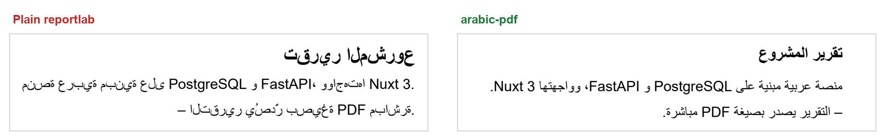

# Arabic Office Skills

[](https://github.com/asadeisa/arabic-office-skills/actions/workflows/tests.yml)

[](LICENSE)

Three agent skills for producing **PDF, Word, and PowerPoint files in Arabic**
— and any other right-to-left script — that actually render correctly.

Arabic output breaks in ways that are invisible until someone opens the file:
letters stand apart instead of joining, lines within a paragraph swap places,
table columns end up mirrored, and the space around an English term silently
disappears. None of it shows up in extracted text, because the characters are
all present and correct. Only their shape and placement are wrong.



Same text, same font, same call. On the left the letters stand apart, the title
reads back to front, and `Nuxt 3` has jumped out of the sentence — that is what
plain reportlab produces, not an exaggeration of it.

Each skill fixes this for one format, and each bundles a working Python library
plus a `preview()` that renders the result to PNG so it can be checked before
delivery.

| Skill | Format | Library |
|---|---|---|
| [`arabic-pdf`](arabic-pdf/) | `.pdf` | reportlab |
| [`arabic-docx`](arabic-docx/) | `.docx` | python-docx |
| [`arabic-pptx`](arabic-pptx/) | `.pptx` | python-pptx |

## The one thing worth knowing

These three formats need **opposite** techniques, and the most common way to
break Arabic output is to carry the right fix into the wrong format.

| | reportlab (and Pillow without libraqm) | Word / PowerPoint (and Pillow with libraqm) |
|---|---|---|
| Text engine | **none** | full bidirectional engine |
| Expects | final visual-order glyphs | **raw logical-order Unicode** |
| Technique | reshape + bidi + manual line wrapping | direction flags in the OOXML |

`arabic_reshaper` + `python-bidi` are mandatory for PDF and destructive for
Word and PowerPoint — those shape at render time, so pre-shaped text gets shaped
twice, leaving broken glyphs and text that can no longer be searched, copied, or
spell-checked.

Word and PowerPoint instead need direction flags the Python libraries do not
expose, so the bundled scripts write them into the XML directly:

- **Word** — `w:themeFontLang`, `w:bidi` on paragraphs and sections, `w:rtl` on
  runs, `w:bidiVisual` on tables, and the complex-script font slot `w:cs`/`w:szCs`
- **PowerPoint** — `lang` per run, `rtl="1"` and `algn="r"` on paragraphs,
  `rtl="1"` on tables, `<a:cs>` for fonts, `xml:space="preserve"` on text

Each flag fails silently and independently. Missing `lang` on a PowerPoint run
turns `PostgreSQL و` into `PostgreSQLو`; putting it on the whole paragraph
instead turns `Nuxt 3` into `3Nuxt`.

## Beyond direction flags

Correct direction flags are necessary, not sufficient. These were each found in
real Arabic reports and defense decks, and each is handled by the libraries:

| Defect | Where | What the skills do |
|---|---|---|
| Arabic in a bold run stays regular; Arabic headings come out smaller | Word | bold, italic and size written to the complex-script slots (`w:bCs`, `w:iCs`, `w:szCs`), in runs and in every style |
| TOC, captions and headings render Arabic in Calibri Light | Word | theme font references stripped from styles |
| `WD_ALIGN_PARAGRAPH.RIGHT` aligns an Arabic paragraph to the **left** | Word | alignment written as `start`/`end` only |
| `C#` → `#C`, `.NET` → `NET.`, `+963` → `963+` | all | flush affixes kept with their token |
| Steps and numbered cards run 01 → 04 from the left | PowerPoint | `rtl_positions()`, `steps_slide()` |
| Fly-in and wipe animations enter from the left | PowerPoint | fade transitions and builds, in RTL reading order |
| Text typed later into the deck starts on the left | PowerPoint | presentation and master defaults made RTL |
| A user's hand edits lost when the document is regenerated | Word | `insert_before()` edits in place |

And both Office libraries can **audit** and **repair** files made elsewhere:
`audit_docx` / `audit_pptx` list what a reader would see wrong,
`fix_docx` / `fix_pptx` retrofit the flags onto the existing structure.

## Install

```bash
git clone https://github.com/asadeisa/arabic-office-skills.git
mkdir -p ~/.claude/skills
cp -r arabic-office-skills/arabic-* ~/.claude/skills/
```

On Windows (PowerShell):

```powershell
git clone https://github.com/asadeisa/arabic-office-skills.git
New-Item -ItemType Directory -Force "$HOME\.claude\skills" | Out-Null
Copy-Item -Recurse arabic-office-skills\arabic-* "$HOME\.claude\skills\"
```

Python 3.10 or later. Dependencies, by skill:

```bash
pip install reportlab arabic-reshaper python-bidi pypdfium2   # arabic-pdf
pip install python-docx pypdfium2                             # arabic-docx
pip install python-pptx pypdfium2                             # arabic-pptx
```

Rendering `.docx` and `.pptx` previews needs Microsoft Office or LibreOffice.
Generating the files needs neither.

## Using them

With Claude Code the skills trigger on their own — ask for an Arabic report,
document, or deck. With any other agent or on their own, the libraries are plain
Python — single files with no package to install, so put the skill's `scripts/`
folder on the path (or copy the `.py` file next to your script):

```python
import sys, pathlib
sys.path.insert(0, str(pathlib.Path.home() / ".claude/skills/arabic-pdf/scripts"))

from arabic_pdf import ArabicPDF, preview

pdf = ArabicPDF("تقرير.pdf")
pdf.title("عنوان المستند")
pdf.heading("أولاً — المقدمة")
pdf.para("نص عربي مع مصطلحات مثل PostgreSQL و FastAPI.")
pdf.table(["الطبقة", "التقنية"], [["الواجهة", "Nuxt 3"]], [5, 11])
pdf.save()
preview("تقرير.pdf")
```

`ArabicDocx` and `ArabicPptx` follow the same shape, with more for long
documents and talks — headings on real styles, a table of contents, numbered
captions, page numbers; RTL step layouts, transitions and click-by-click
builds. Each `SKILL.md` documents its own API, the XML it sets, and what to
look for when checking the output.

Checking a file someone else made:

```python
from arabic_docx import audit_docx, fix_docx

for finding in audit_docx("report.docx"):
    print(finding)
fix_docx("report.docx", "report-fixed.docx")
```

## Persian, Urdu, and Hebrew

They work the same way. For PDF only the font needs to cover the script; for
PowerPoint pass the language too:

```python
ArabicPptx(rtl_lang="fa-IR")   # also ur-PK, he-IL
```

## Repository layout

```text
arabic-pdf/    SKILL.md + scripts/arabic_pdf.py    reportlab builder, draw_text, preview
arabic-docx/   SKILL.md + scripts/arabic_docx.py   Word builder, audit_docx, fix_docx, preview
arabic-pptx/   SKILL.md + scripts/arabic_pptx.py   PowerPoint builder, audit_pptx, fix_pptx, preview
tests/         unit tests (pytest) and render_check.py
docs/          README artwork
```

Each skill folder is self-contained and can be copied on its own. Its
`SKILL.md` is the complete reference — the instructions an agent follows, the
full API, the XML it writes, and a checklist for the rendered result — so read
that, not this README, before generating files with a skill.

## Tests

```bash
pip install pytest python-docx python-pptx reportlab arabic-reshaper python-bidi
pytest tests
```

The same tests run in CI on Python 3.10, 3.12 and 3.14 for every push and pull
request. They need neither Office nor LibreOffice.

The unit tests check the XML. What a reader sees can only be checked by
rendering: `python tests/render_check.py` builds sample files, audits them and
renders them through the installed Word and PowerPoint (or LibreOffice) to
`tests/out/`. Look at the PNGs before a release.

What changed between versions is in [CHANGELOG.md](CHANGELOG.md).

## License

MIT — see [LICENSE](LICENSE).
